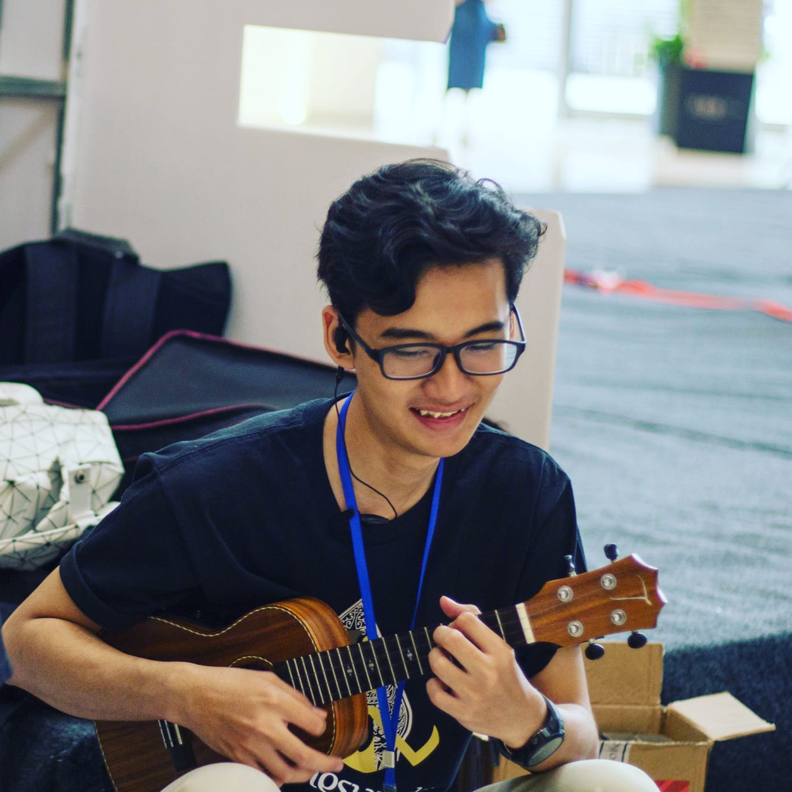
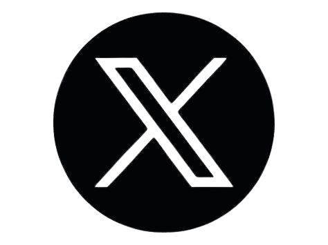

# M Afif Firos Fikri Profile
> This is an assignment for Module 1 - Checkpoint #1

## My Bio
Hai, it is me!

You can call me Afif. I graduated from *Zhejiang University of Technology*, Software Engineering. I excited to learn about coding and hopefully i can work as a Software Engineer because its my dream mas :satisfied:

**Name**                  : Muhammad Afif Firos Fikri\
**Place, date of birth**  : Gresik, 16 October 1998\
**Gender**                : Male\
**Hobby**                 : Badminton, Games, and Hangout\
**Nationality**           : Indonesia

## My Social Media
*  My Instagram [afiffkr](https://www.instagram.com/afiffkr/)
*  My X [pippMantu_](https://twitter.com/pippMantu_)
*  My Linkedn [Muhammad Afif Firos Fikri](https://www.linkedin.com/in/afiffikri/)

## My Example Table
| Number | English | Mandarin  |
| :----: | :-----: | :-------: |
|   1    |   one   | 一（yi）  |
|   2    |   two   | 二（er）  |
|   3    |  three  | 三（san） |
|   4    |  four   | 四（si）  |
|   5    |  five   | 五（wu）  |